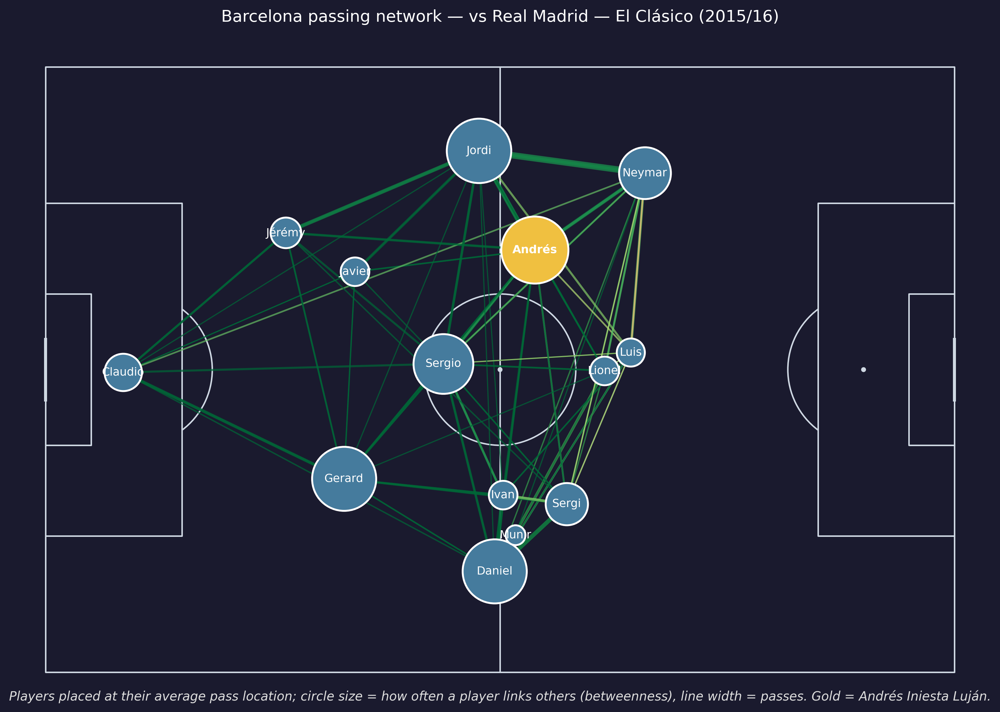

# Tactical Topology: Football as a Communication Network

[](https://www.python.org/)
[](LICENSE)
[](https://github.com/statsbomb/open-data)

Analyse football team tactical structure by treating a team's passing as a
**communication network** — applying ideas from telecoms and graph theory
(fault-tolerance, max-flow/min-cut, processing latency, signal interference) to
StatsBomb event data. The project layers three interpretable ML models on top of
those metrics and ships publication-quality figures. Everything is reproducible
from free, public data with no API keys.



## Football as a network — the idea (for non-engineers)

Picture a football team as a phone or computer network. Each **player is a node**;
each **pass is a message** sent from one node to another. Once you see a team this
way, questions from communication engineering start to translate into football:

- **Resilience / fault tolerance** — if one node (player) goes down, does the
  network keep working? The players whose removal hurts most are the team's true
  hubs (for Barcelona 2015/16: Busquets, Iniesta, Dani Alves).
- **Max-flow / min-cut** — how much "traffic" can the team push from its own end
  of the pitch to the opponent's goal, and where is the bottleneck?
- **Latency / tempo** — how long does a node hold the ball before relaying it?
  Low latency = quick, one-touch football.
- **Interference** — opponent pressing is like signal noise; we measure how much
  it degrades passing quality.

## Installation

```bash
pip install -r requirements.txt          # flexible install
# or, for the exact environment that produced the committed results/figures:
pip install -r requirements-lock.txt     # pinned versions
```

Python 3.10+; data comes from [StatsBomb Open Data](https://github.com/statsbomb/open-data)
via `statsbombpy` (no credentials needed). Working dataset: La Liga 2015/16
(`competition_id=11`, `season_id=27`).

## Quick start

```bash
python scripts/run_pipeline.py
```

This caches the data, computes the telecom metrics, builds the full-season
feature matrices, and regenerates every figure in `figures/`. (First run loads
all ~380 matches, so allow a few minutes.) The narrative lives in the notebooks:

```
notebooks/01_data_exploration.ipynb     # cleaned data sanity checks
notebooks/02_network_construction.ipynb # passing networks
notebooks/03_telecom_metrics.ipynb      # resilience / flow / tempo / pressure
notebooks/04_ml_models.ipynb            # clustering, outcome model, shift detection
notebooks/05_visualisations.ipynb       # the six figures
```

Run the test suite with `pytest`.

## What's inside

| Module | Role |
|---|---|
| `tactical_topology.loader` | load + clean StatsBomb events |
| `tactical_topology.network` | build static & dynamic passing networks |
| `tactical_topology.telecom` | resilience, max-flow, tempo, pressure metrics |
| `tactical_topology.ml` | feature matrix, clustering, outcome model, shift detection |
| `tactical_topology.viz` | publication figures |

## Key results (La Liga 2015/16)

- **Metrics match football intuition.** Resilience flags Barcelona's
  midfield/ball-playing defenders (Busquets, Iniesta, Alves) as structurally
  critical; completion drops ~8pp under pressure (81%→73%); and
  attacking-flow-efficiency separates *directness* from *possession* (direct
  sides score higher than Barcelona). These confirm known facts through a
  communication-network lens rather than discovering new ones.
- **Clustering** cleanly isolates the two possession giants (Barcelona, Real
  Madrid) from the rest. Note the *strongest* silhouette is at **k=2** (that
  possession-vs-rest split); the k=4 "tiers" are reported for tactical
  granularity, not because four groups are statistically clean. Figure cluster
  names are derived from each cluster's own density profile, not hardcoded.
- **Outcome model (honest framing).** Predicting full-match W/D/L from
  **first-half** network features alone reaches **~42% cross-validated accuracy
  (±3pp across folds)** against a **38% majority-class baseline** (33% is the
  3-class random baseline). The ~4pp lift is small but **statistically real**: a
  200-run label-permutation test gives p≈0.01 (null mean ~37%). An honest
  signal, not a strong predictor.
- **Tactical-shift detection** is illustrative only. On the inspected match
  3/4 detected change-points fall near a goal/substitution, but this is **not**
  significant against a random-placement null (p≈0.17: a randomly placed
  change-point already lands within ±3 min of an event ~39% of the time). Treat
  it as a qualitative tool, not a benchmarked detector.

## Paper

A full write-up of the method and results is in
**[`paper/Tactical_Topology.pdf`](paper/Tactical_Topology.pdf)**. Rebuild it from
the current data and figures with:

```bash
python paper/make_diagrams.py      # architecture + concept diagrams
python paper/compute_results.py    # exact numbers -> paper/results.json
python paper/build_paper.py        # -> paper/Tactical_Topology.pdf
```

## Blog post

_Write-up to be linked here after publication._

## Citation

```bibtex
@software{raptis_tactical_topology,
  author = {Raptis, Nikos},
  title  = {Tactical Topology: Football as a Communication Network},
  year   = {2026},
  note   = {Analysis of StatsBomb open data using communication-network theory},
  url    = {https://github.com/nraptisss/Football-as-a-Communication-Network}
}
```

Built on [StatsBomb Open Data](https://github.com/statsbomb/open-data).
